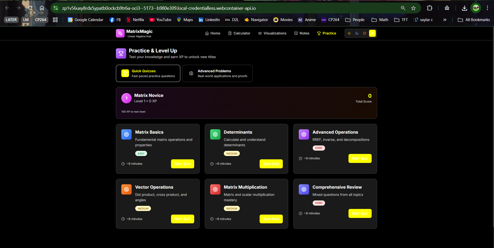

# MatrixMagic

MatrixMagic is an interactive web application for learning linear algebra.  
It combines step‑by‑step matrix calculators, visualizations, and gamified practice into a single experience.  
The project is written in **React** and **TypeScript** using **Vite** and **Tailwind CSS**.

---

## Features

### 🧮 Calculators
- **Basic operations** – add, subtract, multiply or scale matrices.
- **Advanced operations** – transpose, determinant, inverse, RREF and rank.
- **Vector operations** – dot product, cross product, normalization, magnitude and angles.
- **Equation solver** – solve systems $Ax = b$ via RREF or matrix inverse and show detailed steps.
- **Advanced calculators** – characteristic polynomial and matrix functions (exponential, sine, cosine, powers).
- Each calculator includes dynamic matrix input, error handling and result export (copy/CSV).
- Step‑by‑step mode for RREF and inverse with play/pause controls.

### 📘 Study Notes
- Rich notes covering fundamentals, operations, determinants, eigenvalues and RREF.
- Worked examples with step lists and final answers.
- Embedded video tutorials and links to external resources.
- **Formula reference** – searchable list of common formulas with categories and favorites.

### 🧠 Practice
- Quick quizzes with scoring, XP and unlockable titles stored in local storage.
- Advanced problems featuring real‑world scenarios, multi‑step challenges and proofs.
- Progress tracking and accuracy stats.

### 📊 Visualizations
- **2D canvas** – draw vectors, transformations and eigenvectors with zoom and pan.
- **3D canvas** – rotate objects, display vectors and animate transformations.
- **Real-world applications** – interactive demos for PCA, physics simulations and image processing.
- **Interactive animations** – algorithms like Gaussian elimination, eigenvalue decomposition, SVD, LU factorization.

### 🎨 User Experience
- Responsive design and works offline.
- Four themes (light, dark, warm, high contrast) with a toggle.
- Smooth transitions and animations powered by **Framer Motion**.

---

## 🖼️ Media Demos

### Screenshots  
- `cal example.png`:  
  

- `pratice.png`:  
  

- `rref step by step.png`:  
  

### Video Demo  
- [`mm demo github.mp4`](./pics/mm%20demo%20github.mp4) – walkthrough of the MatrixMagic interface and functionality.

---

## ⚙️ Technologies
- **React 18** with **TypeScript**
- **Vite** build tool
- **Tailwind CSS** for styling
- **Framer Motion** for animations
- **Lucide React** for icons
- **ESLint** + **TypeScript ESLint** for linting

---

## Getting Started
1. Install Node.js.
2. Run `npm install` to install dependencies.
3. Use `npm run dev` to start the development server or `npm run build` to create a production build.

## License
This project is provided for educational purposes.
